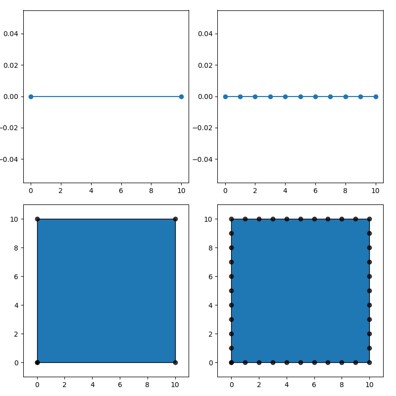

# Documentation
MShapely is a [Shapely](https://shapely.readthedocs.io/en/latest/manual.html) wrapper to enhance shapely functionalities and to manipulate spatial data for Marine Energy Resource Assessment Canada.

It provides extra functionality such as complex resampling, simplification, nearest nodes, etc. MShapely was mainly developed to help the development of complex 2-dimensional meshes for free-surface hydrodynamic models in coastal regions.

(Todo) add image here


#### Chaining Method
MShapely and Shapely smartly employs a technique called chain syntax.
By “chaining” methods together with periods, you can perform several actions in a single line of code. 
It means is that when you call a method on an object, it performs the method and returns an object. 
Since the method on an object returns an object, another method can be called without having to explicitly reference an object again. 

Here's an example:
```python
from shapely.geometry import Point
import mshapely

# Non-chaining method
point = Point((0,0))
circle = point.buffer(1)

# Chaining method
circle = Point((0,0)).buffer(1)
```

### Density Field Documentation
[Docs](density.md)

### User-guide and Examples
New attributes and methods are applied for all geometric objects (Point, LineString, Polygon, MultiPoint, MultiLineString, MultiPolygon, GeometryCollection).
However, some of the methods are not applicable (i.e point.resample()) and returns the original object. 
Most of the methods returns a geometric object with a few exception (i.e. object.inearest()) - check "output" in the method description.

#### object.np
```
  Returns numpy array of the object.
  It returns coordinates,(and ids for line and polygon)
  XY coordinates are always place last.

  Note
  ----
  x:x-coordinate
  y:y-coordinate
  lid: line id
  pid: polygon id
  cid: collection id
  
  Output
  ------ 
  ndarray: 2D array
   shape: Point, (npoint,2) : [[x,y]] 
          LineString, (npoint,3) : [[lid,x,y]]
          Polygon, (npoint,4) : [[pid,lid,x,y]]
          MultiPoint, (npoint,3) : [[x,y]]
          MultiLineString, (npoint,4) : [[cid,lid,x,y]]
          MultiPolygon, (npoint,5) : [[cid,pid,lid,x,y]]
```
Examples
```python
>>> Point(0,0).np
[[0. 0.]]

>>> LineString([[0,0],[1,0],[2,0]]).np
[[0. 0. 0.]
 [1. 1. 0.]
 [2. 2. 0.]]

>>> Polygon([[0,0],[1,0],[2,0],[0,0]]).np
[[0. 0. 0. 0.]
 [0. 1. 1. 0.]
 [0. 2. 2. 0.]
 [0. 0. 0. 0.]]

>>> MultiPoint([[0,0],[1,0],[2,0],[0,0]]).np
[[0. 0.]
 [1. 0.]
 [2. 0.]
 [0. 0.]]
 
>>> MultiLineString([[[0,0],[1,0]],[[2,0],[3,0]]]).np
[[0. 0. 0. 0.]
 [0. 1. 1. 0.]
 [1. 0. 2. 0.]
 [1. 1. 3. 0.]]
 
>>> MultiPolygon([Polygon([[0,0],[1,0],[2,0],[0,0]])]).np
[[0. 0. 0. 0. 0.]
 [0. 0. 1. 1. 0.]
 [0. 0. 2. 2. 0.]
 [0. 0. 0. 0. 0.]]
 
```

#### object.xy
```
  Returns numpy array of the object xy coordinates.
  Output
  ------ 
  ndarray: 2D array
   shape:(npoint,2) : [[x,y]] 
```
Examples
```python
>>> Point(0,0).xy
[[0. 0.]]

>>> LineString([[0,0],[1,0],[2,0]]).xy
[[0. 0.]
 [1. 0.]
 [2. 0.]]

>>> Polygon([[0,0],[1,0],[2,0],[0,0]]).xy
[[0. 0.]
 [1. 0.]
 [2. 0.]
 [0. 0.]]
 
>>> MultiPoint([[0,0],[1,0],[2,0],[0,0]]).xy
[[0. 0.]
 [1. 0.]
 [2. 0.]
 [0. 0.]]
 
>>> MultiLineString([[[0,0],[1,0]],[[2,0],[3,0]]]).xy
[[0. 0.]
 [1. 0.]
 [2. 0.]
 [3. 0.]]
 
>>> MultiPolygon([Polygon([[0,0],[1,0],[2,0],[0,0]])]).xy
[[0. 0.]
 [1. 0.]
 [2. 0.]
 [0. 0.]]
```

#### object._np([,isNorm,onPoint])
```
  Returns object numpy array with normal vector information.
  Only applicable for LineString, Polygon, MultiLineString, MultiPolygon
  
  Parameters
  ----------
  isNorm: bool,optional
    If True, returns normal vectors information
  onPoint: bool,optional
    If True,computes normal vectors on point.
    If False, computer normal vector from segment.
    Default is True.
  
  Output
  ------ 
  ndarray: 2D array
   shape: LineString, (npoint,7) : [[lid,xo,yo,xn,yn,x,y]]
          Polygon, (npoint,4) : [[pid,lid,xo,yo,xn,yn,x,y]]
          MultiLineString, (npoint,4) : [[cid,lid,xo,yo,xn,yn,x,y]]
          MultiPolygon, (npoint,5) : [[cid,pid,lid,xo,yo,xn,yn,x,y]]
```

Examples
```python
>>> LineString([[0,0],[1,0],[2,0]])._np()
[[0. 0. 0.]
 [1. 1. 0.]
 [2. 2. 0.]]
 
>>> LineString([[0,0],[1,0],[2,0]])._np(isNorm=True)
[[ 0.  0.  0.  0.  1.  0.  0.]
 [ 1.  1.  0.  0. -1.  1.  0.]
 [ 2.  2.  0.  0.  1.  2.  0.]]

>>> LineString([[0,0],[1,0],[2,0]])._np(isNorm=True,onPoint=False)
[[ 0.   0.5  0.   0.  -1.   0.   0. ]
 [ 1.   1.5  0.   0.  -1.   1.   0. ]
 [ 2.   1.   0.   0.   1.   2.   0. ]]

```
#### object.write(path[,schema,properties])
```
  """
  Write geometry object to file (geojson or shapefile).
  
  Parameters
  ----------
  path: str
  schema: dict,optional
   Schema is used for shapefiles. 
   Creates it automatically unless specified.
  properties: list,optional
   Length must be equal to length of the object.
  """
```
Examples
```python
>>> path_p_geo="test_io.point.geojson"
>>> path_p_shp="test_io.point.shp"
>>> Point((0,0)).write(path_p_geo).write(path_p_shp)
```
#### object.delete(path) or mshapely.io.delete(path)
```
  """
  Delete file. 
  Deleting shapefiles will delete associate files.
  
  Parameters
  ----------
  path: str
  """
```
Examples
```python
>>> path_p_shp="test_io.point.shp"
>>> Point((0,0)).write(path_p_shp,type="shp").delete(path_p_shp)
```

#### object.densityField(properties[,minDensity=None,maxDensity=None,growth=None])
```
  Creates a Density Field object. This is used to resample (Multi)LineString and (Multi)Polygon based on a density field.
  Takes xy coordinates from geometry object.
  Needs properties: density and growth.
  
  Parameters
  ----------
  properties: list
    Requires a list of dict containing density and growth, {"density","growth"}
    The length of list must be equal to the length of xy.
  minDensity: float,
    Default minDensity of the field. If None, it takes minimum value of array-density
  maxDensity: float,
    Default maxDensity of the field. If None, it takes maximum value of array-density
  growth:float,
    Default growth of the field. If None,it will take minimum value of array-growth
  Output
  -----
  DensityField
```
Examples
```python
>>> path_p_shp="test_io.point.shp"
>>> Point((0,0)).write(path_p_shp,type="shp").delete(path_p_shp)
```

#### object.resample([,maxLength])
```
  Resample object using equal segment length. 
  The segment is automatically calculated using the length of the LineString and maxLength parameter.
  The segment is equal or smaller than the maxLength.
  
  Parameters
  ----------
  maxLength: float,optional
    Default is 1.0.
```
Examples
```python
>>> LineString([(0,0),(10,0)])
>>> LineString([(0,0),(10,0)]).resample()
>>> Polygon([(0, 0), (0, 10),(10,10),(10,0),(0,0)])
>>> Polygon([(0, 0), (0, 10),(10,10),(10,0),(0,0)]).resample()
```
[](img/resample.1.png)


#### object.dresample(df[,mp])
```
  Resample object using a 2D density growth field. 
  The length of the segments are automatically calculated based on the density growth field.
  The growth of the field depends on the density points and growth factor.
  
  Parameters
  ----------
  density: Density Field object
  mp:MultiPoint,optional
   MultiPoint are part of the resampling. 
   An error will raise if the distance between points are smaller than minDensity.
```
Examples
```python
>>> LineString([(0,0),(30,0)]).dresample(np.array([[0,0,1]]), minDensity=1.0, maxDensity=5.0, growth=1.2)
```
[](img/dresample.1.png)
```python
>>> mp = MultiPoint([(100,0)])
>>> density = np.array([[0,0,100],[100,0,1],[200,0,100]])
>>> LineString([(0,0),(200,0)]).dresample(density=density,mp=mp,minDensity=2.0, maxDensity=100.0, growth=1.2)
```
[](img/dresample.2.png)
```python
>>> mp = MultiPoint([(0, 0), (0, 100),(100,100),(100,0)])
>>> density = np.array([[0,0,1],[100,100,1]])
>>> Polygon([(0, 0), (0, 100),(100,100),(100,0),(0,0)]).dresample(density,minDensity=2.0, maxDensity=20.0, growth=1.2)
>>> Polygon([(0, 0), (0, 100),(100,100),(100,0),(0,0)]).dresample(density,mp,minDensity=2.0, maxDensity=20.0, growth=1.2)
```
[](img/dresample.3.png)
```python
>>> polygon = Point((0,0)).buffer(100)
>>> hole1 = Point((-50,0)).buffer(20)
>>> hole2 = Point((50,0)).buffer(20)
>>> polygon = Polygon(polygon.exterior,[hole1.exterior.coords[::-1],hole2.exterior.coords[::-1]])
>>> density = np.array([[-100,0,5],[100,0,5]])
>>> mp = MultiPoint([(-100, 0), (0, 100),(0,100),(0,-100)])
>>> polygon.dresample(density,mp, minDensity=5.0, maxDensity=50.0, growth=1.2)
```
[](img/dresample.4.png)

#### object.removeHoles([,area])
```
  Remove small holes inside a polygon.
  
  Parameters
  ----------
  area: float
    Default is 1.0.
```
Examples
```python
>>> polygon = Polygon([(0, 0), (0, 1),(1,1),(1,0),(0,0)],[LineString([(0.25, 0.25),(0.75,0.25) ,(0.75,0.75),(0.25, 0.75),(0.25,0.25)])])
>>> polygon.removeHoles()
>>> polygon.removeHoles(0.1)
````
[](img/removeHoles.1.png)

#### object.largest()
```
  Gets only the largest polygon from a MultiPolygon and GeometryCollection
```
Examples
```python
>>> MultiPolygon([Polygon([(0,0),(1,0),(1,1),(0,1),(0,0)]),Polygon([(0,0),(-0.5,0),(-0.5,-0.5),(0,-0.5),(0,0)])]).largest()
````
[](img/largest.1.png)


#### mshapely.dsimplify(df)

```python
>>> holes = [
    Point(10,0).buffer(5).exterior.coords[::-1],
    Point(25,0).buffer(5).exterior.coords[::-1],
    Point(70,0).buffer(5).exterior.coords[::-1],
    Point(85,0).buffer(5).exterior.coords[::-1],
    
    Point(0,15).buffer(10).exterior.coords[::-1],
    Point(0,40).buffer(10).exterior.coords[::-1],
    Point(0,65).buffer(10).exterior.coords[::-1],
    Point(0,87.5).buffer(10).exterior.coords[::-1],
    
    ]
  
  
>>> polygon = Polygon(exterior,holes)
>>> polygon.plot("o-",axes[0][0])
>>> polygon.dsimplify(np.array([[0,0,1]]),minDensity=1,maxDensity=100).plot("o-",axes[0][1])
>>> polygon.dsimplify(np.array([[0,0,5]]),minDensity=5,maxDensity=100).plot("o-",axes[0][2])
>>> polygon.dsimplify(np.array([[0,0,10]]),minDensity=10,maxDensity=100).plot("o-",axes[1][0])
>>> polygon.dsimplify(np.array([[0,0,20]]),minDensity=20,maxDensity=100).plot("o-",axes[1][1])
>>> polygon.dsimplify(np.array([[0,0,100]]),minDensity=100,maxDensity=1000).plot("o-",axes[1][2])
>>> polygon.dsimplify(np.array([[0,0,5],[0,100,5]]),minDensity=5,maxDensity=100).plot("o-",axes[2][0])
>>> polygon.dsimplify(np.array([[0,0,10],[0,100,5]]),minDensity=5,maxDensity=100).plot("o-",axes[2][1])
>>> polygon.dsimplify(np.array([[0,0,20],[0,100,5]]),minDensity=5,maxDensity=100).plot("o-",axes[2][2])
```
[](img/dsimplify.1.png)

#### object.inearest(maxDistance[,angle,nvalue])
```
  Computes nearest interior nodes based on its normal and angle range.
  
  Parameters
  ----------
  maxDistance:float
   Maximum search distance.
  angle:float
   Angle range. Default value is 90.0. 
  nvalue:int
    Number of points processed at the same time.
  
  Output
  ------
  ndarray:2D array
   shape:(n,3)
    n: Number of points in the original object.
    3:x,y,density  
  
```
Examples
```python
>>> polygon = Point((0,0)).buffer(100)
>>> hole1 = Point((-50,0)).buffer(20)
>>> hole2 = Point((50,0)).buffer(20)
>>> polygon = Polygon(polygon.exterior,[hole1.exterior.coords[::-1],hole2.exterior.coords[::-1]])
>>> density=polygon.inearest(maxDistance=100,angle=90)
````
[](img/inearest.1.png)

#### object.plot()
```
  Plot geometry object in matplotlib
  
  Parameters
  ----------
  type:
  axe:
  color:
  style:
```
Examples
```python
````
#### object.savePlot(path)
```
  Save plot to file
  
  Parameters
  ----------
  path: filepath
```
Examples
```python
````

## Creating user guide

```python
PYTHONPATH=../mshapely/ python3 doc/doc_mshapely.py
```