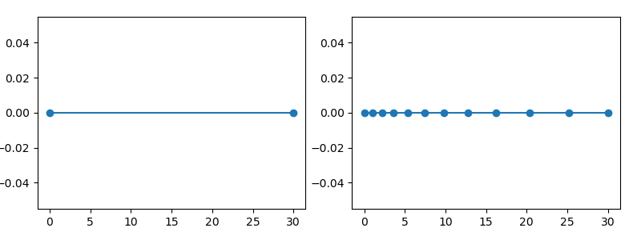
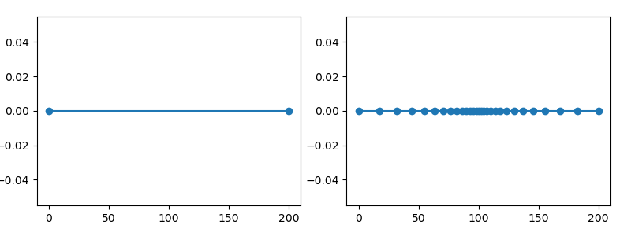
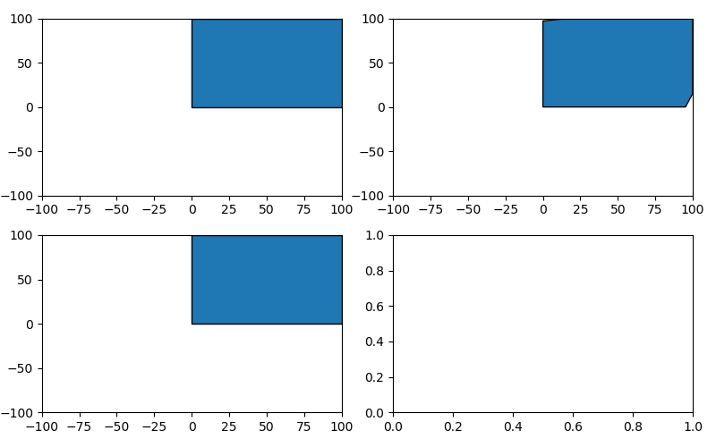
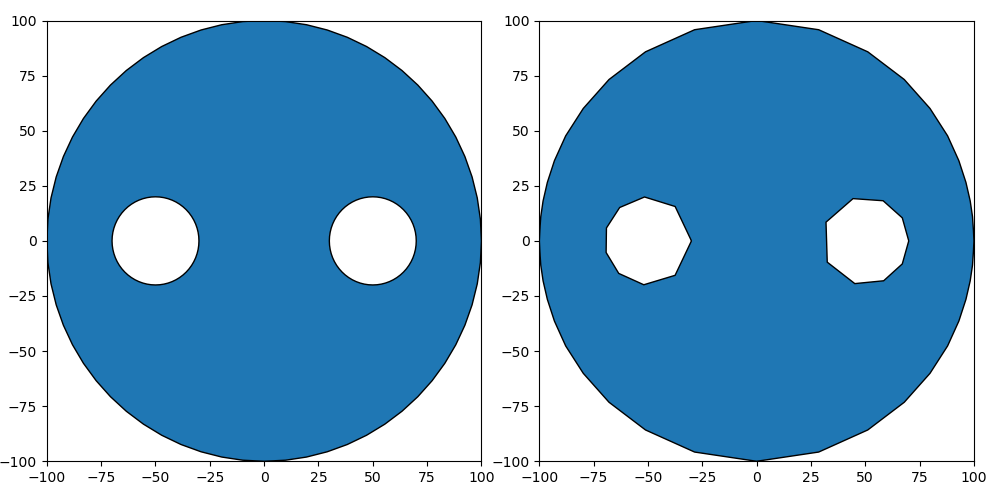
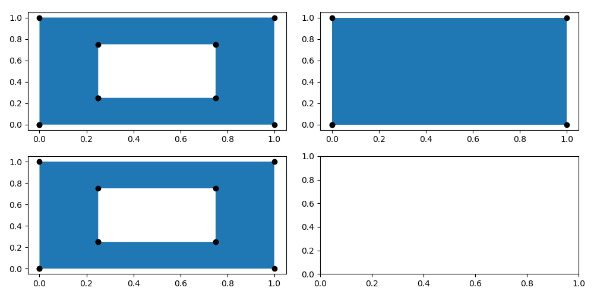
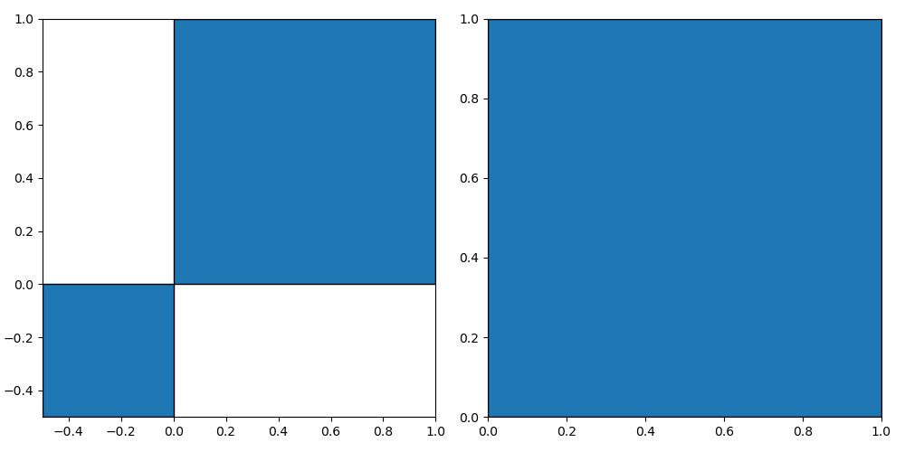
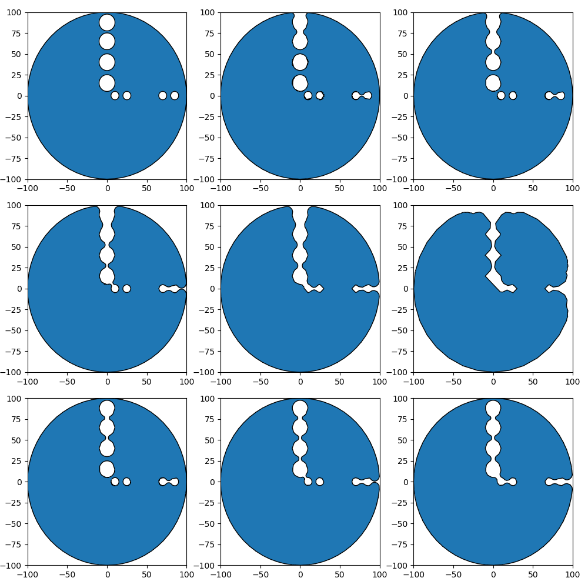
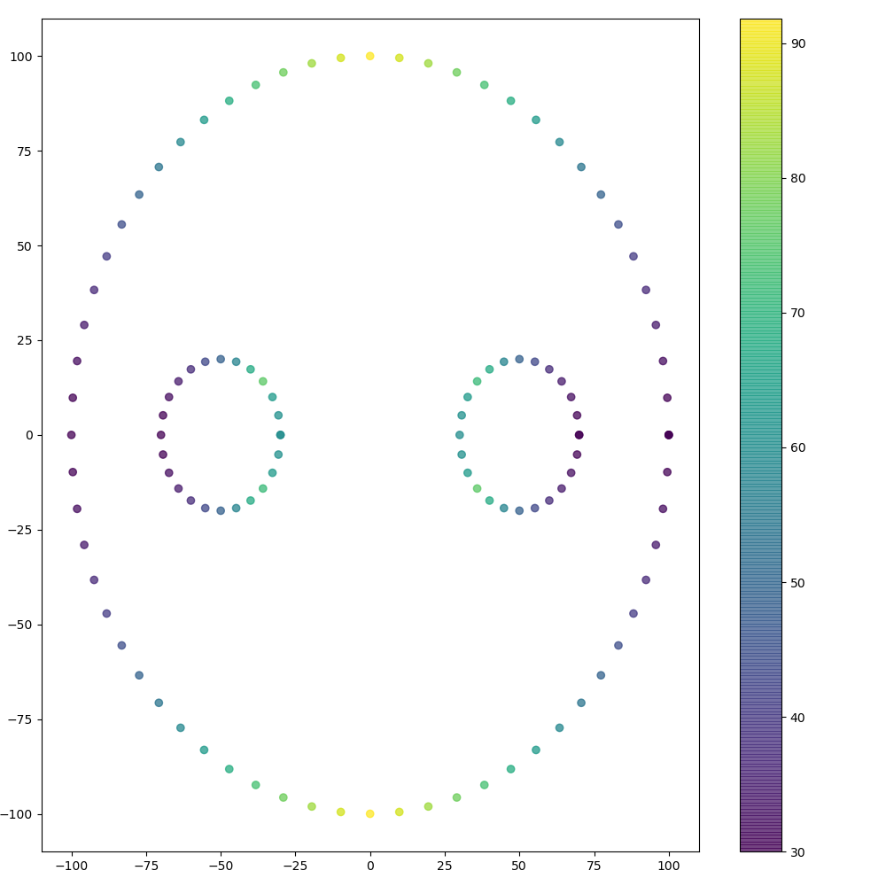

# Introduction

#### Chain approach

#### General Attributes and Methods


#### object.np
```
  Returns numpy array of the object. 
  The array contains coordinates(xy) and parent ids.
  
  Output
  ------ 
  ndarray: 2D array. 
   shape: Varies depending on the object and parameters. 
```
Examples
```python
>>> Point(0,0).np
[[0. 0.]]

>>> LineString([[0,0],[1,0],[2,0]]).np
[[0. 0. 0.]
 [1. 1. 0.]
 [2. 2. 0.]]

>>> Polygon([[0,0],[1,0],[2,0],[0,0]]).np
[[0. 0. 0. 0.]
 [0. 1. 1. 0.]
 [0. 2. 2. 0.]
 [0. 0. 0. 0.]]

>>> MultiPoint([[0,0],[1,0],[2,0],[0,0]]).np
[[0. 0. 0.]
 [1. 1. 0.]
 [2. 2. 0.]
 [3. 0. 0.]]
 
>>> MultiLineString([[[0,0],[1,0]],[[2,0],[3,0]]]).np
[[0. 0. 0. 0.]
 [0. 1. 1. 0.]
 [1. 0. 2. 0.]
 [1. 1. 3. 0.]]
 
>>> MultiPolygon([Polygon([[0,0],[1,0],[2,0],[0,0]])]).np
[[0. 0. 0. 0. 0.]
 [0. 0. 1. 1. 0.]
 [0. 0. 2. 2. 0.]
 [0. 0. 0. 0. 0.]]
 
```

#### object.xy
```
  Returns the xy coordinates of the object.
  Output
  ------ 
  ndarray: 2D array. 
   shape:(npoint,2)
```
Examples
```python
>>> Point(0,0).xy
[[0. 0.]]

>>> LineString([[0,0],[1,0],[2,0]]).xy
[[0. 0.]
 [1. 0.]
 [2. 0.]]

>>> Polygon([[0,0],[1,0],[2,0],[0,0]]).xy
[[0. 0.]
 [1. 0.]
 [2. 0.]
 [0. 0.]]
 
>>> MultiPoint([[0,0],[1,0],[2,0],[0,0]]).xy
[[0. 0.]
 [1. 0.]
 [2. 0.]
 [0. 0.]]
 
>>> MultiLineString([[[0,0],[1,0]],[[2,0],[3,0]]]).xy
[[0. 0.]
 [1. 0.]
 [2. 0.]
 [3. 0.]]
 
>>> MultiPolygon([Polygon([[0,0],[1,0],[2,0],[0,0]])]).xy
[[0. 0.]
 [1. 0.]
 [2. 0.]
 [0. 0.]]
```


#### object._np([,isNorm,onPoint])
```
  Returns the numpy array of the object with special requirements.
  Parameters
  ----------
  isNorm: bool,optional
    If True, returns normal vectors information
  onPoint: bool,optional
    If True,computes normal vectors from point.
    If False, computer normal vector from segment
    Default is True.
  
  Output
  ------ 
  ndarray: 2D array. 
   shape: Varies depending on the object and parameters. 
```

Examples
```python
>>> LineString([[0,0],[1,0],[2,0]])._np()
[[0. 0. 0.]
 [1. 1. 0.]
 [2. 2. 0.]]
 
>>> LineString([[0,0],[1,0],[2,0]])._np(isNorm=True)
[[ 0.  0.  0.  0.  1.  0.  0.]
 [ 1.  1.  0.  0. -1.  1.  0.]
 [ 2.  2.  0.  0.  1.  2.  0.]]

>>> LineString([[0,0],[1,0],[2,0]])._np(isNorm=True,onPoint=False)
[[ 0.   0.5  0.   0.  -1.   0.   0. ]
 [ 1.   1.5  0.   0.  -1.   1.   0. ]
 [ 2.   1.   0.   0.   1.   2.   0. ]]

```
#### object.write(path[,schema,properties,type])
```
  """
  Write to file
  
  Parameters
  ----------
  path: str
  schema: dict,optional
   Schema is used for shapefiles. 
   Creates on automatically unless specified.
  properties: list,optional
   Length must be equal to length of the object.
  type: enum, optional
   "shp","geojson". Default is "geojson"
  """
```
Examples
```python
>>> path_p_geo="test_io.point.geojson"
>>> path_p_shp="test_io.point.shp"
>>> Point((0,0)).write(path_p_geo,type="geojson").write(path_p_shp,type="shp")
```
#### object.delete(path) or mshapely.io.delete(path)
```
  """
  Delete file. 
  Deleting shapefiles will delete associate files.
  
  Parameters
  ----------
  path: str
  """
```
Examples
```python
>>> path_p_shp="test_io.point.shp"
>>> Point((0,0)).write(path_p_shp,type="shp").delete(path_p_shp)
```

#### object.resample(maxLength)
```
  Resample object using equal segment length. 
  The segment is automatically calculated using the maxLength or smaller segment.
  
  Parameters
  ----------
  maxLength: float,optional
    Default is 1.0.
```
Examples
```python
>>> LineString([(0,0),(10,0)]).resample()
LINESTRING (0 0, 1 0, 2 0, 3 0, 4 0, 5 0, 6 0, 7 0, 8 0, 9 0, 10 0)
```

#### object.dresample(density[,mp,minDensity,maxDensity,growth])
```
  Resample object using a 2D density growth field. 
  The length of the segments are automatically calculated based on the density growth field.
  The growth of the field depends on the density points and growth factor.
  
  Parameters
  ----------
  density: ndarray
   shape:(n,3)
       n:n density points
       3:x,y,density
  mp:MultiPoint,optional
   MultiPoint are part of the resampling. 
   An error will raise if the distance between points are smaller than minDensity.
  minDensity:float,optional
    Smallest segment length. Default is 1.0.
  maxDensity:float,optional
    Largest segment length. Default is 10.0.
  growth:float,optional
    Density growth factor. Default is 1.2.
    
```
Examples
```python
>>> LineString([(0,0),(30,0)]).dresample(np.array([[0,0,1]]), minDensity=1.0, maxDensity=5.0, growth=1.2)
```
[](img/dresample.1.png)
```python
>>> mp = MultiPoint([(100,0)])
>>> density = np.array([[0,0,100],[100,0,1],[200,0,100]])
>>> LineString([(0,0),(200,0)]).dresample(density=density,mp=mp,minDensity=2.0, maxDensity=100.0, growth=1.2)
```
[](img/dresample.2.png)
```python
>>> mp = MultiPoint([(0, 0), (0, 100),(100,100),(100,0)])
>>> density = np.array([[0,0,1],[100,100,1]])
>>> Polygon([(0, 0), (0, 100),(100,100),(100,0),(0,0)]).dresample(density,minDensity=2.0, maxDensity=20.0, growth=1.2)
>>> Polygon([(0, 0), (0, 100),(100,100),(100,0),(0,0)]).dresample(density,mp,minDensity=2.0, maxDensity=20.0, growth=1.2)
```
[](img/dresample.3.png)
```python
>>> polygon = Point((0,0)).buffer(100)
>>> hole1 = Point((-50,0)).buffer(20)
>>> hole2 = Point((50,0)).buffer(20)
>>> polygon = Polygon(polygon.exterior,[hole1.exterior.coords[::-1],hole2.exterior.coords[::-1]])
>>> density = np.array([[-100,0,5],[100,0,5]])
>>> mp = MultiPoint([(-100, 0), (0, 100),(0,100),(0,-100)])
>>> polygon.dresample(density,mp, minDensity=5.0, maxDensity=50.0, growth=1.2)
```
[](img/dresample.4.png)

#### object.removeHoles([,area])
```
  Remove small holes inside a polygon.
  
  Parameters
  ----------
  area: float
    Default is 1.0.
```
Examples
```python
>>> polygon = Polygon([(0, 0), (0, 1),(1,1),(1,0),(0,0)],[LineString([(0.25, 0.25),(0.75,0.25) ,(0.75,0.75),(0.25, 0.75),(0.25,0.25)])])
>>> polygon.removeHoles()
>>> polygon.removeHoles(0.1)
````
[](img/removeHoles.1.png)

#### object.largest()
```
  Gets only the largest polygon from a MultiPolygon and GeometryCollection
```
Examples
```python
>>> MultiPolygon([Polygon([(0,0),(1,0),(1,1),(0,1),(0,0)]),Polygon([(0,0),(-0.5,0),(-0.5,-0.5),(0,-0.5),(0,0)])]).largest()
````
[](img/largest.1.png)

#### mshapely.MultiDensity.dsimplify([,minDensity=1,maxDensity=10,growth=1.2])
#### mshapely.dsimplify_Point(density[,minDensity=1,maxDensity=10,growth=1.2])
```
  Simplify object from remove and simplifying shape by respecting the density growth field.
  For Polygon, it mainly uses the buffer/unbuffer techniques for different density area/zone.
  
  Parameters
  ----------
 density: ndarray
   shape:(n,3)
       n:n density points
       3:x,y,density
  minDensity:float,optional
    Smallest segment length. Default is 1.0.
  maxDensity:float,optional
    Largest segment length. Default is 10.0.
  growth:float,optional
    Density growth factor. Default is 1.2.
```
Examples
```python
>>> mshapely.MultiDensity([[0,0,1],[10,0,5],[20,0,2],[30,0,1],[40,0,3]]).dsimplify()
[[ 0.  0.  1.]
 [20.  0.  2.]
 [30.  0.  1.]]
>>> mshapely.dsimplify_Point(np.array([[0,0,1.],[10,0,5],[20,0,2],[30,0,1],[40,0,3]]))
[[ 0.  0.  1.]
 [20.  0.  2.]
 [30.  0.  1.]]
````

```python
>>> holes = [
    Point(10,0).buffer(5).exterior.coords[::-1],
    Point(25,0).buffer(5).exterior.coords[::-1],
    Point(70,0).buffer(5).exterior.coords[::-1],
    Point(85,0).buffer(5).exterior.coords[::-1],
    
    Point(0,15).buffer(10).exterior.coords[::-1],
    Point(0,40).buffer(10).exterior.coords[::-1],
    Point(0,65).buffer(10).exterior.coords[::-1],
    Point(0,87.5).buffer(10).exterior.coords[::-1],
    
    ]
  
  
>>> polygon = Polygon(exterior,holes)
>>> polygon.plot("o-",axes[0][0])
>>> polygon.dsimplify(np.array([[0,0,1]]),minDensity=1,maxDensity=100).plot("o-",axes[0][1])
>>> polygon.dsimplify(np.array([[0,0,5]]),minDensity=5,maxDensity=100).plot("o-",axes[0][2])
>>> polygon.dsimplify(np.array([[0,0,10]]),minDensity=10,maxDensity=100).plot("o-",axes[1][0])
>>> polygon.dsimplify(np.array([[0,0,20]]),minDensity=20,maxDensity=100).plot("o-",axes[1][1])
>>> polygon.dsimplify(np.array([[0,0,100]]),minDensity=100,maxDensity=1000).plot("o-",axes[1][2])
>>> polygon.dsimplify(np.array([[0,0,5],[0,100,5]]),minDensity=5,maxDensity=100).plot("o-",axes[2][0])
>>> polygon.dsimplify(np.array([[0,0,10],[0,100,5]]),minDensity=5,maxDensity=100).plot("o-",axes[2][1])
>>> polygon.dsimplify(np.array([[0,0,20],[0,100,5]]),minDensity=5,maxDensity=100).plot("o-",axes[2][2])
```
[](img/dsimplify.1.png)

#### object.inearest(maxDistance[,angle,nvalue])
```
  Computes nearest interior nodes based on its normal and angle range.
  
  Parameters
  ----------
  maxDistance:float
   Maximum search distance.
  angle:float
   Angle range. Default value is 90.0. 
  nvalue:int
    Number of points processed at the same time.
  
  Output
  ------
  ndarray:2D array
   shape:(n,3)
    n: Number of points in the original object.
    3:x,y,density  
  
```
Examples
```python
>>> polygon = Point((0,0)).buffer(100)
>>> hole1 = Point((-50,0)).buffer(20)
>>> hole2 = Point((50,0)).buffer(20)
>>> polygon = Polygon(polygon.exterior,[hole1.exterior.coords[::-1],hole2.exterior.coords[::-1]])
>>> density=polygon.inearest(maxDistance=100,angle=90)
````
[](img/inearest.1.png)
#### object.correct()
```
  Correct geometric object using the buffer functionality
  
  Note
  ----
  The constant mshapely.CB is used.
```
Examples
```python

````
#### object.plot()
```
  Plot geometry object in matplotlib
  
  Parameters
  ----------
  type:
  axe:
  color:
  style:
```
Examples
```python
````
#### object.savePlot(path)
```
  Save plot to file
  
  Parameters
  ----------
  path: filepath
```
Examples
```python
````

### Creating user guide

```python
PYTHONPATH=../mshapely/ python3 doc/doc_mshapely.py
```

##
```
obj = {
      "name":"example1", # Required
      "format":"slf", # Required
      "localFolder":"../data/example1",
      "minDensity":10,
      "maxDensity":10000, # 
      "shorelineGrowth":1.2, # Shorelfine default growth
      "simplification":{"isimplify":10,"buffer":1000,"fsimplify":10}, # Default coastline simplication
      "defaultDomain":{"center":[-63.553987,44.627934],"radius":60,"density":10,"growth":1.2}, # Optional, radius is in km
      
      "input":{
        "osm":"../data/water-polygons-split-4326.zip", # Optional, it downloads the file if not specified
        "sosm":"../data/simplified-water-polygons-split-3857.zip",# Optional, it downloads the file if not specified
        # "domain":"../data/example1/domain.geojson",# Optional, it uses defaultDomain if not specified 
        # "density":"../data/example1/density.geojson",# Optional, it uses defaultDomain.center if not specified
        
        
        # "globalbathymetry":"", # Optional, it downloasds the file if not specified
        
        # "bathymetry":"",# Optional
        # "roughess":"",# Optional
      },
    }
```